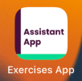

# Exercises App - Assistant App

This application lists the exercises using free Rapid Api and we can make a search and show detail screen.

### APP Movie

### App Tools 
- Flutter 3.3.6
- MVVM - with setState
- Routes
- Service Api Call
- Search
- Theme Color
- Custom Widgets

### Packages
- [pub.dev](https://pub.dev/)
  - [http: ^0.13.5](https://pub.dev/packages/http)
  - [flutter_launcher_icons: ^0.10.0](https://pub.dev/packages/flutter_launcher_icons)
  - [flutter_native_splash: ^2.2.14](https://pub.dev/packages/flutter_native_splash)

### API
- [Rapid API](rapidapi.com)
  - [Exercises by API-Ninjas](https://rapidapi.com/apininjas/api/exercises-by-api-ninjas/)
    

### App Icon

### App Splash Screen

### Home - Exercises List

### Search

### Detail Page

